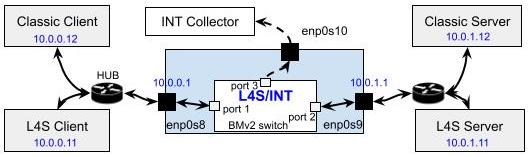

# Description

This folder contains statistics of the L4S switch. Each sub folder represents a test scenario which is generated by varying one of the 3 parameters below
- `duration`: test duration, in number of seconds
- `LL bandwidth`: bandwidth of the LL flow, in Mbps
- `CL bandwidth`: bandwidth of the CL flow, in Mbps

The structure of a sub folder is as the following:

- `param.txt`: values of the three above parameters of the test scenario
- `config.log`: configuration of the L4S switch
- `cpu_mem_int_yes_pid_xxx.txt`: CPU and memory usages of the L4S switch
- `mmt-probe.conf`: configuration of the INT collector (MMT-Probe)
- `pcap.tar.gz`: pcap file of the INT packets that were sent to the collector by the INT
- `script.log`: log of the script that run this test scenario
- `sw-simple.log`: log of the L4S switch
- `data.csv`: statistic data. Its fields are detailed in the next section

The following figure represents the testbed: IPs of clients/servers, port numbers, NICs, etc

# CSV Headers

- `report-id`: report ID (alway 1000)
- `probe-id`: ID of the INT collector (always 3)
- `source`: NIC where the INT collect recived the INT packet (always 'enp0s10')
- `timestamp`: epoch timestamp when the INT packet arrived at the INT collector
- `report-name`: name of the report (always 'int')
- `packet_index`: order of the INT packet
- `meta.packet_len`: length of the INT packet, in bytes
- `ip.src`: IP source address
- `ip.dst`: IP destination address
- `ip.proto_tos`: IP type of service (ToS)
- `ip.ecn`: IP ECN number
- `ip.identification`: IP identification number
- `tcp.src_port`: TCP source port number
- `tcp.dest_port`: TCP destination port number
- `tcp.seq_nb`: TCP sequence number
- `tcp.ack_nb`: TCP ACK number
- `tcp.tsval`: TCP TSval number
- `tcp.tsecr`: TCP TSecr number
- `int.queue_id`: ID of the router's queue through which the packet went. 1 = LL queue, 0 = CL queue 
- `int.latency`: the time, in microsecond, that it takes for the packet to be processed within the router
- `int.queue_occups`: the number of packets in the queue (where the packet went through), at the moment the packet was sent out.
- `int.ingress_time`: switch's local time, in nanosecond, when the packet was received. The clock is set to 0 every time the switch starts.
- `int.egress_time`: switch's local time, in nanosecond, when the packet was sent out. The clock is set to 0 every time the switch starts.
- `int.nb_marked`: number of packets that have been marked by the switch
- `int.nb_dropped`: number of packets that have been dropped by the switch
- `int.mark_probability`: number that represents mark probability of that switch at the moment the packet was sent out

# Note

- we may need to filter out the SSH traffic which have `tcp.dest_port == 22`
- TODO: we need to calculate RTT of a packet by using `tcp.tsval` and `tcp.tsecr` (or using its `tcp.ack_nb`, `tcp.seq_nb`)
